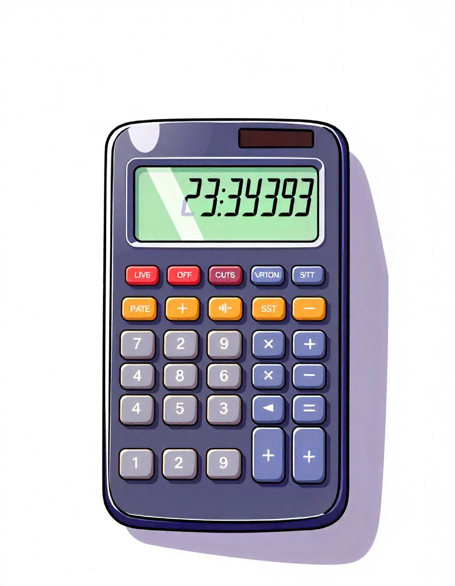

### Took me almost two days to complete the project. I'm tired af

   

## How to Use:
    For those of y'all who live under a rock and don't know how to use a calculator yet, let me enlighten y'all
        - Click on the digits to display them onto the display screen
        - Clicking on the operator button tells the program that now you are ready to enter the second number
        - Buttons such as %(percentage), .(decimal) and +/-(sign) are modifiers, which change the number which the user is currently typing
        - Once you'r done entering the mathematical expression, click on the =(equal-to) button to calculate the output, which again, will be displayed onto the display screen

   

`Plz, for the love of God, do not load the webpage on mobile devices. I haven't yet made the webpage responsive to mobile screens. So, do me a favor and stick to Laptops and Desktops :)`

  

I ran out of quirk things to say :( 

22:28
31st October, 2024